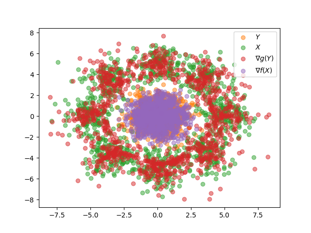

# ot-icnn-minimal

A minimal exmaple of optimal transport with Input Convex Neural Networks (ICNNs) using pytorch.

Uses defaults from https://arxiv.org/abs/1908.10962

Running should produce plots like this:

